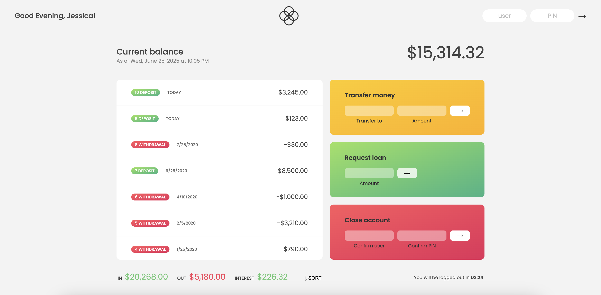

# Bankist Application

Bankist is a fictitious, feature-rich banking interface that includes functionalities such as:

- Logging in with a username and password
- Transation history with dates
- Ability to sort transactions by amount
- Transfering money to other active accounts
- Loan requests
- Account Deletion
- Automatica log out after 5 minutes of inactivity per session
- Dynamically display date, time and monetary amounts as per account locale and currency using Intl API

Avaliable Log in Credentials:
- username: js | password: 1111
- username: jd | password 2222
- username: stw | password 3333
- username: ss | password 4444

## Skills

Built purely with vanilla JavaScript, this application showcases advanced front-end development skills, including dynamic DOM manipulation, the effective implementation of modern ES6+ (arrow functions, destructuring, spread operator, optional chaining, etc.), internationalization with the Intl API for date, time and currency formatting, and functional programming with array methods like map, filter, and reduce, for clean data manipulation,. With a focus on clean data modeling, real-time UI updates, and locale-aware formatting, Bankist delivers a polished, user-centric experience without relying on external libraries or frameworks.

## Author

**Rhea Phillips**
[rheaphillips](https://github.com/rheaphillips)

## Instruction Credit

Jonas Schmedtmann: "The Complete JavaScript Course 2021: From Zero to Expert!" Udemy Course
